# NYC Transportation Data Pipeline

## Vue d'ensemble

Pipeline ELT (Extract-Load-Transform) end-to-end de grade production pour l'analyse des donnees de transport de New York City. Ce projet traite plus de 50 millions d'enregistrements mensuels provenant de 8 sources de donnees heterogenes, orchestrant des extractions multi-frequences (horaire, quotidien, mensuel) via Apache Airflow, stockant les donnees brutes sur Google Cloud Storage, les transformant via dbt Core selon une architecture Medallion (Raw, Staging, Intermediate, Marts) dans BigQuery, avec une gouvernance IAM stricte appliquant le principe du moindre privilege.

---

## Table des matieres

1. [Stack Technique](#stack-technique)
2. [Architecture globale](#architecture-globale)
3. [Sources de donnees](#sources-de-donnees)
4. [Orchestration avec Apache Airflow](#orchestration-avec-apache-airflow)
5. [Data Lake sur Google Cloud Storage](#data-lake-sur-google-cloud-storage)
6. [Architecture Medallion avec dbt](#architecture-medallion-avec-dbt)
7. [Optimisations BigQuery](#optimisations-bigquery)
8. [Securite et gouvernance GCP](#securite-et-gouvernance-gcp)
9. [Conteneurisation avec Docker](#conteneurisation-avec-docker)
10. [Qualite des donnees](#qualite-des-donnees)
11. [Perspectives et evolutions](#perspectives-et-evolutions)
12. [Installation et configuration](#installation-et-configuration)
13. [Documentation et references](#documentation-et-references)

---

## Stack Technique

| Domaine | Technologies | Competences |
|---------|--------------|-------------|
| **Orchestration** | Apache Airflow 3.0+ | DAGs multi-frequences, XCom, retry logic, ... |
| **Cloud Platform** | Google Cloud Platform | GCS, BigQuery, IAM & Service Accounts |
| **Data Warehouse** | BigQuery | Partitioning, Clustering, Incremental loading, optimisation des couts |
| **Transformation** | dbt Core 1.7+ | Architecture Medallion, tests de qualite, documentation auto-generee |
| **Conteneurisation** | Docker, Docker Compose | Stack distribuee multi-services, volumes persistants |
| **Langages** | Python 3.9+, SQL | ELT, APIs REST, pagination, gestion d'erreurs |
| **Formats de donnees** | JSON, CSV, Parquet | Gestion multi-formats, schemas auto-detectes |
| **APIs** | NYC Open Data, NOAA | Authentification, pagination, rate limiting |

---

## Architecture globale

L'architecture suit le paradigme ELT moderne avec separation claire des responsabilites :


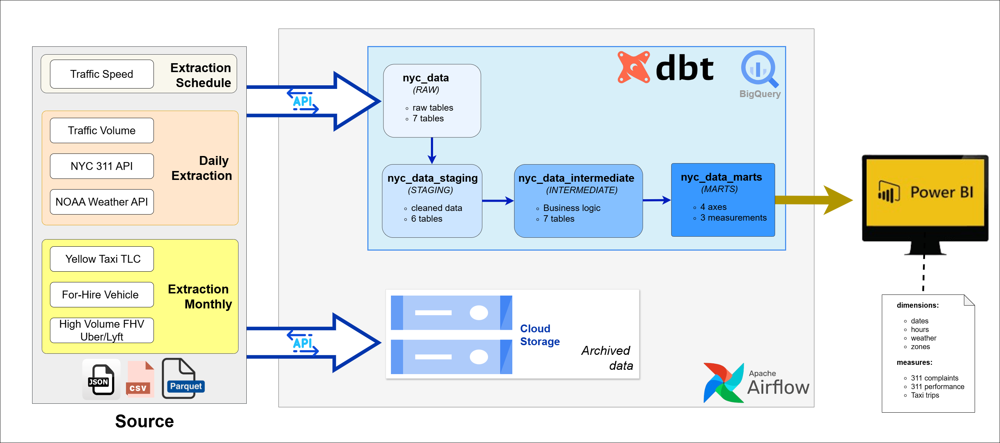

---

## Sources de donnees

Ce pipeline integre 8 sources de donnees differentes, chacune avec sa propre frequence d'extraction, son format et son volume :

### Recapitulatif des sources

| Source | Frequence | Format | Volume estime | Endpoint |
|--------|-----------|--------|---------------|----------|
| NYC Real-Time Traffic Speed | Horaire (24x/jour) | JSON | ~50K lignes/heure | NYC Open Data API |
| NYC Traffic Volume Counts | Quotidien | CSV | ~50K lignes/jour | NYC Open Data API |
| NYC 311 Service Requests | Quotidien | JSON | ~50K lignes/jour | NYC Open Data API |
| NOAA Weather Data | Quotidien | JSON | 4 metriques/jour | NOAA NCEI API |
| Yellow Taxi Trips | Mensuel | Parquet | ~3M lignes/mois | TLC CloudFront |
| For-Hire Vehicle Trips | Mensuel | Parquet | ~15M lignes/mois | TLC CloudFront |
| High Volume FHV (Uber/Lyft) | Mensuel | Parquet | ~20M lignes/mois | TLC CloudFront |

### Volume total mensuel : 50+ millions d'enregistrements

### Details des extractions

**Donnees horaires** - Traffic Speed en temps reel
- Endpoint : `data.cityofnewyork.us/resource/i4gi-tjb9.json`
- Pagination : `$limit=50000`, `$offset` incremental
- Filtrage temporel : `data_as_of BETWEEN 'YYYY-MM-DDTHH:MM:SS'`
- Retry logic : 3 tentatives avec backoff exponentiel

**Donnees quotidiennes** - 311, Traffic Volume, Weather
- NYC 311 : Plaintes et demandes de service non-urgentes
- Traffic Volume : Comptages de vehicules par intersection
- Weather : Precipitations (PRCP), temperatures min/max (TMIN/TMAX), neige (SNOW)
- Station meteorologique : USW00094728 (Central Park)

**Donnees mensuelles** - Taxi et VTC
- Fichiers Parquet de 500MB a 2GB chacun
- Schema auto-detecte par BigQuery
- Chargement direct GCS vers BigQuery

---

## Orchestration avec Apache Airflow

### Vue d'ensemble de l'interface Airflow

L'orchestration complete du pipeline est geree via Apache Airflow avec une interface centralisee pour le monitoring :

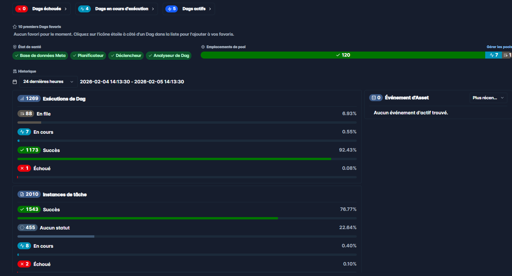

### DAGs d'extraction configures

Chaque source de donnees dispose de son propre DAG avec une configuration specifique :

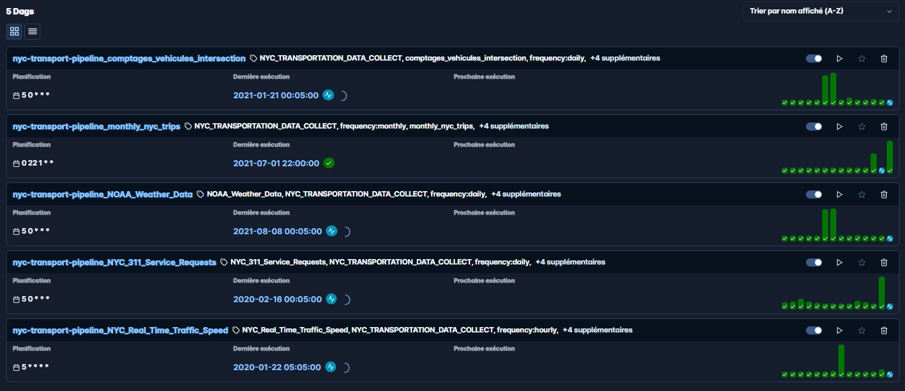

### Architecture des DAGs

**6 DAGs operationnels :**

| DAG | Schedule | Description |
|-----|----------|-------------|
| `nyc-transport-pipeline_NYC_Real_Time_Traffic_Speed` | `5 * * * *` | Extraction horaire des vitesses de trafic |
| `nyc-transport-pipeline_comptages_vehicules_intersection` | `5 0 * * *` | Comptages vehicules quotidiens |
| `nyc-transport-pipeline_NYC_311_Service_Requests` | `5 0 * * *` | Plaintes citoyennes quotidiennes |
| `nyc-transport-pipeline_NOAA_Weather_Data` | `5 0 * * *` | Donnees meteo quotidiennes |
| `nyc-transport-pipeline_monthly_nyc_trips` | `0 22 1 * *` | Courses taxi mensuelles (3 types) |
| `nyc-transport-pipeline_transformations` | `0 3 * * *` | Transformations dbt quotidiennes |

### Pattern d'extraction standardise

Tous les DAGs suivent un pattern architectural uniforme garantissant la coherence et la maintenabilite :

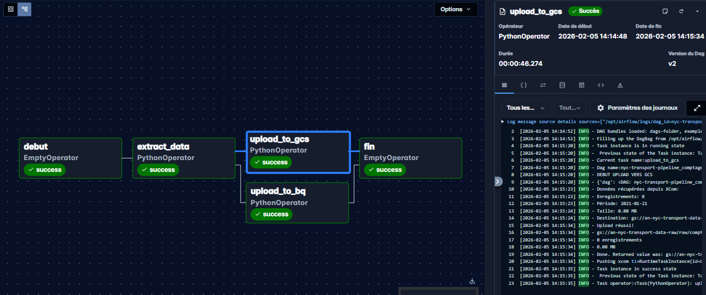

Architecture du workflow :
```
debut (EmptyOperator)
    |
    v
extract_data (PythonOperator)
    |
    +---> upload_to_gcs (PythonOperator) [Parallel]
    |
    +---> upload_to_bq (PythonOperator)  [Parallel]
    |
    v
fin (EmptyOperator)
```

### Variante du pattern pour sources multiples

Le DAG mensuel illustre la gestion de sources paralleles :

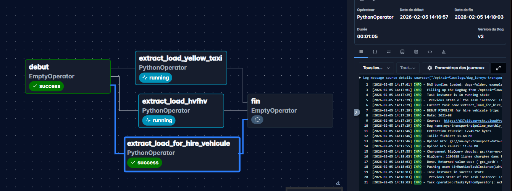

Ce pattern demontre :
- Extraction parallele de 3 types de fichiers (Yellow, FHV, HVFHV)
- Chargement concurrent vers GCS et BigQuery
- Gestion des timeouts pour fichiers volumineux (240s)

### Job de transformation dbt automatise

Les transformations dbt sont orchestrees quotidiennement via un DAG dedié :

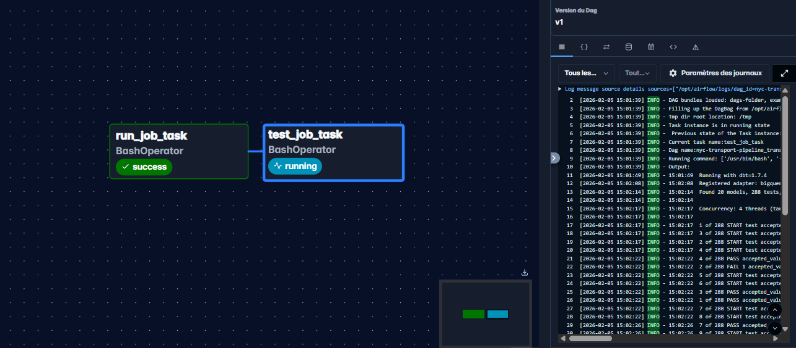

Configuration du DAG de transformation :
- Schedule : `0 3 * * *` (3h00 UTC quotidien)
- Commandes executees sequentiellement :
  1. `dbt run --target prod` : Execution de tous les modeles
  2. `dbt test --target prod` : Validation de la qualite des donnees

---

## Data Lake sur Google Cloud Storage

### Organisation des donnees brutes

Les donnees brutes sont stockees sur GCS selon une structure de partitionnement hierarchique :

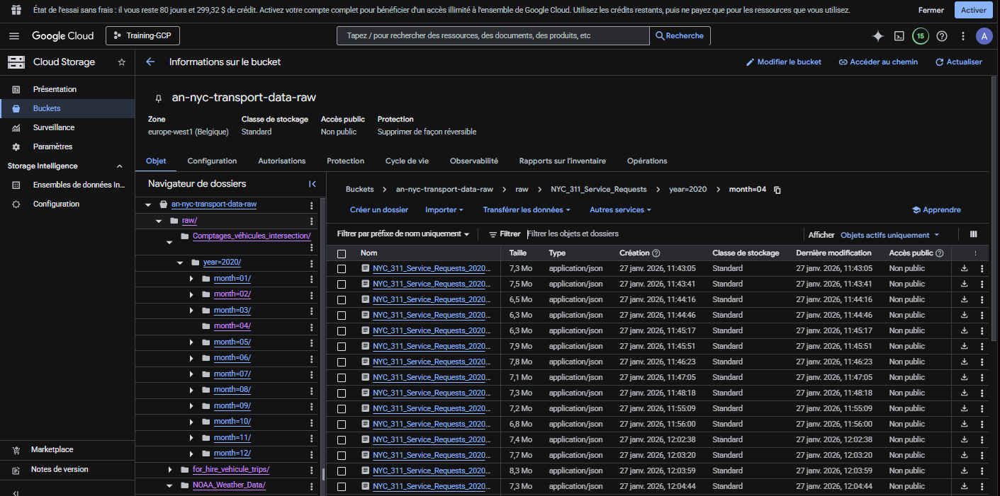

### Structure de partitionnement

```
gs://nyc-data-lake/raw/
|
+-- NYC_Real_Time_Traffic_Speed/
|   +-- year=2024/
|       +-- month=01/
|           +-- day=15/
|               +-- traffic_speed_20240115_1400.json
|
+-- comptages_vehicules_intersection/
|   +-- year=2024/
|       +-- month=01/
|           +-- traffic_volume_20240115.csv
|
+-- NYC_311_Service_Requests/
|   +-- year=2024/
|       +-- month=01/
|           +-- 311_requests_20240115.json
|
+-- NOAA_Weather_Data/
|   +-- year=2024/
|       +-- month=01/
|           +-- weather_20240115.json
|
+-- yellow_taxi_trips/
|   +-- year=2024/
|       +-- yellow_tripdata_2024-01.parquet
|
+-- for_hire_vehicule_trips/
|   +-- year=2024/
|       +-- fhv_tripdata_2024-01.parquet
|
+-- high_volume_vehicule_trips/
|   +-- year=2024/
|       +-- fhvhv_tripdata_2024-01.parquet
```

### Avantages du partitionnement

- **Reduction des couts** : Scan limite aux partitions necessaires
- **Performance** : Lecture selective par date
- **Organisation** : Navigation intuitive des donnees historiques
- **Retention** : Politique de retention par frequence (7j horaire, 90j quotidien, 3ans mensuel)

---

## Architecture Medallion avec dbt

L'architecture Medallion (Bronze/Silver/Gold) organise les donnees en couches de raffinement progressif. Cette approche garantit la tracabilite, la qualite et la separation des responsabilites.

### Vue d'ensemble des tables BigQuery

L'ensemble des tables creees dans BigQuery suivant l'architecture Medallion :

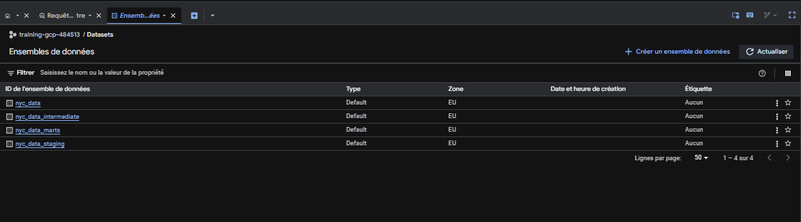

---

### Couche Raw (Bronze)

Les tables raw contiennent les donnees brutes telles qu'extraites des sources, sans transformation.

**7 tables raw :**

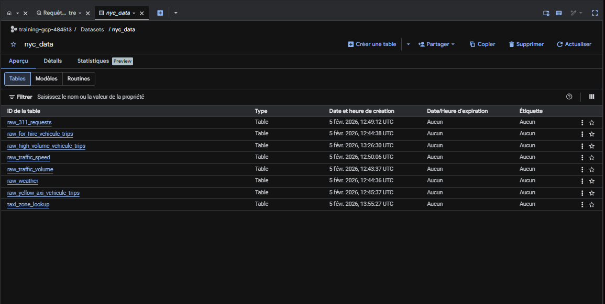

| Table | Source | Volume |
|-------|--------|--------|
| `raw_traffic_speed` | NYC Traffic Speed API | ~1.2M lignes/jour |
| `raw_traffic_volume` | NYC Traffic Volume API | ~50K lignes/jour |
| `raw_311_requests` | NYC 311 API | ~50K lignes/jour |
| `raw_weather` | NOAA API | 4 lignes/jour |
| `raw_yellow_taxi_vehicule_trips` | TLC Parquet | ~3M lignes/mois |
| `raw_for_hire_vehicule_trips` | TLC Parquet | ~15M lignes/mois |
| `raw_high_volume_vehicule_trips` | TLC Parquet | ~20M lignes/mois |

---

### Couche Staging (Silver)

La couche staging nettoie, standardise et filtre les donnees brutes. Les modeles staging sont materialises en vues (dev) ou tables (prod) pour optimiser les couts.

#### Execution des modeles staging


#### Tables staging creees

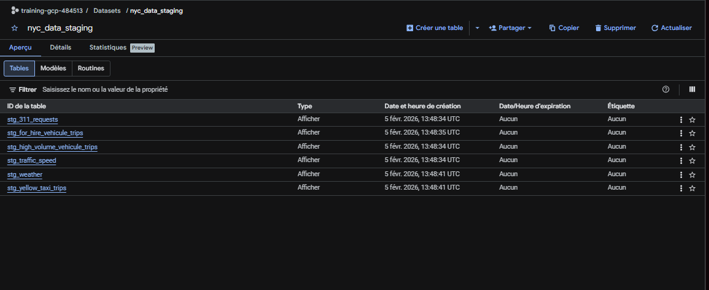

#### Materialisation en vues

En environnement de developpement, les modeles staging sont materialises en vues pour eviter la duplication des donnees :

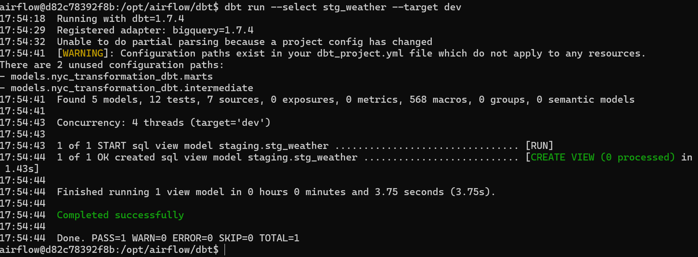

#### Resultat de la creation des vues

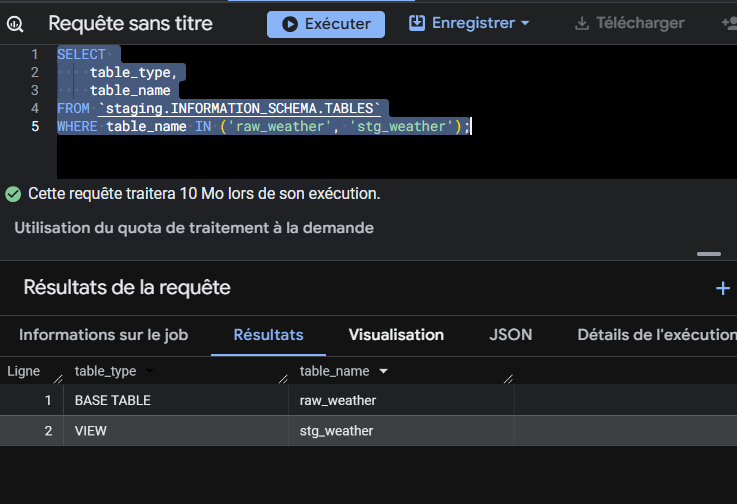

**6 modeles staging implementes :**

| Modele | Transformations appliquees |
|--------|---------------------------|
| `stg_yellow_taxi_trips` | Filtrage dates coherentes, location_id 1-265, montants non-negatifs |
| `stg_for_hire_vehicule_trips` | Conversion FLOAT vers INT des location_id via ROUND() |
| `stg_high_volume_vehicule_trips` | Validation 4 timestamps (request, on_scene, pickup, dropoff) |
| `stg_traffic_speed` | Filtrage vitesse 0-100 mph, travel_time 1-7200s |
| `stg_weather` | Categorisation conditions (Clear, Rain, Snow) |
| `stg_311_requests` | Standardisation borough, complaint_type, status |

#### Tests de qualite staging valides


---

### Couche Intermediate (Gold - Logique metier)

La couche intermediate implemente la logique metier, les jointures et les enrichissements.

#### Execution des modeles intermediate


#### Tables intermediate creees

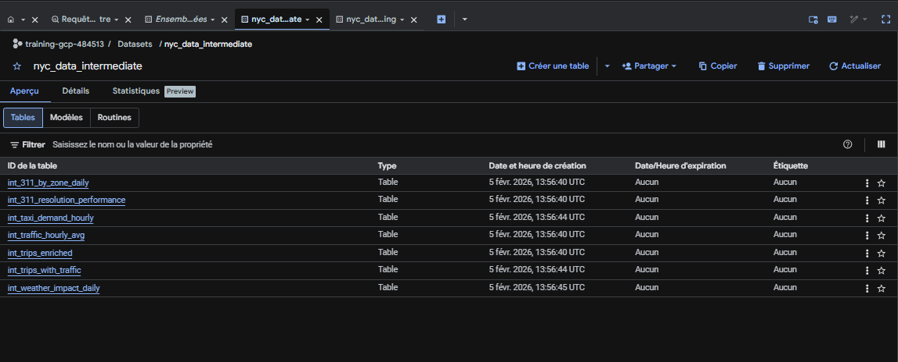

#### Creation des tables intermediate

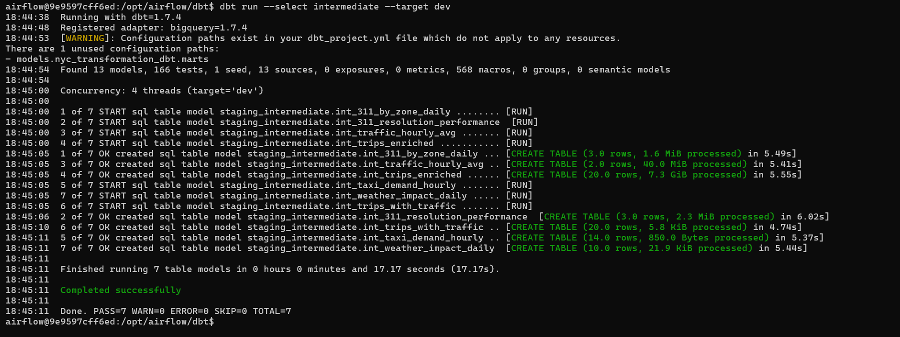

**7 modeles intermediate implementes :**

| Modele | Description | Enrichissements |
|--------|-------------|-----------------|
| `int_trips_enriched` | Union des 3 types de courses | Categories de distance, flags meteo, detection rush hour |
| `int_trips_with_traffic` | Jointure courses + trafic | Vitesse moyenne, congestion, estimation duree |
| `int_311_by_zone_daily` | Agregation plaintes quotidiennes | Total par borough/type, taux de cloture |
| `int_311_resolution_performance` | Performance agences mensuelles | Rankings, scores, mediane resolution |
| `int_taxi_demand_hourly` | Demande taxi par heure/zone | Slots horaires, moyennes |
| `int_traffic_hourly_avg` | Vitesse trafic horaire | Flags congestion severe |
| `int_weather_impact_daily` | Correlation meteo/transport | Jointure trips + traffic + 311 + weather |

---

### Couche Marts (Gold - Analytics)

La couche marts contient les tables optimisees pour l'analyse, structurees en tables de dimensions et de faits.

#### Execution des modeles marts


#### Tables marts creees

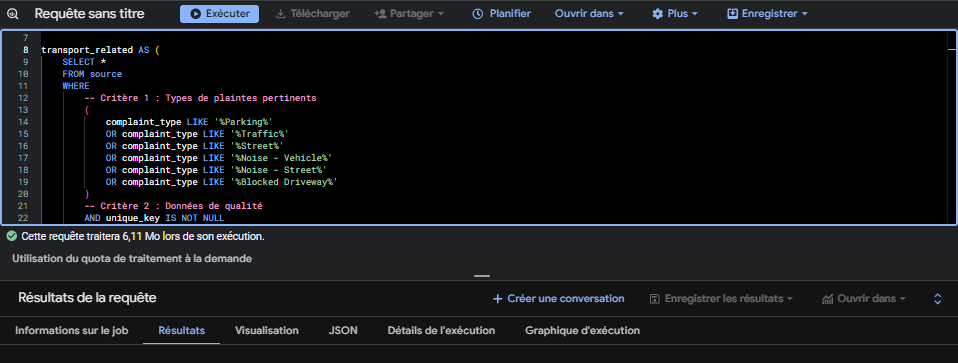

---

### Tables de dimensions

**dim_dates** - Dimension calendrier complete

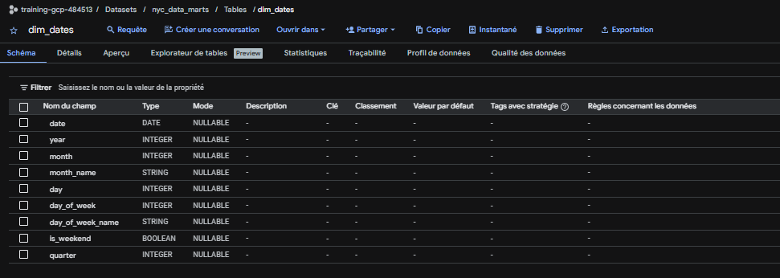

Caracteristiques :
- Plage : 2020 a aujourd'hui
- Colonnes : year, month, month_name, day, day_of_week, day_of_week_name, is_weekend, quarter
- Tests : unicite, not_null, plages acceptees

---

**dim_hours** - Dimension horaire avec categorisations

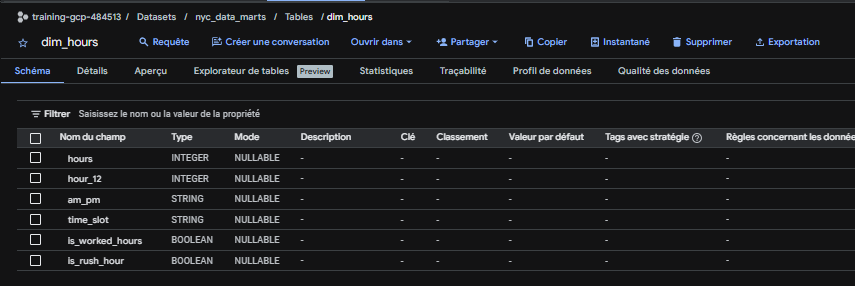

Caracteristiques :
- 24 lignes (0-23 heures)
- Colonnes : hours, hour_12, am_pm, time_slot (Matin/Apres-midi/Soir/Nuit), is_worked_hours, is_rush_hour
- Detection heures de pointe : 7h-10h et 16h-19h

---

**dim_zones** - Dimension geographique NYC

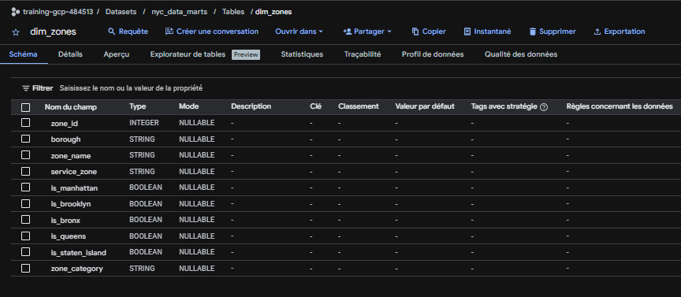

Caracteristiques :
- 265 zones taxi officielles NYC
- Source : taxi_zone_lookup (seed dbt)
- Colonnes : zone_id, borough, zone_name, service_zone
- Flags booleens : is_manhattan, is_brooklyn, is_bronx, is_queens, is_staten_island
- Categories : Airport, Zones touristiques, Business Districts, Autre

---

**dim_weather** - Dimension meteorologique

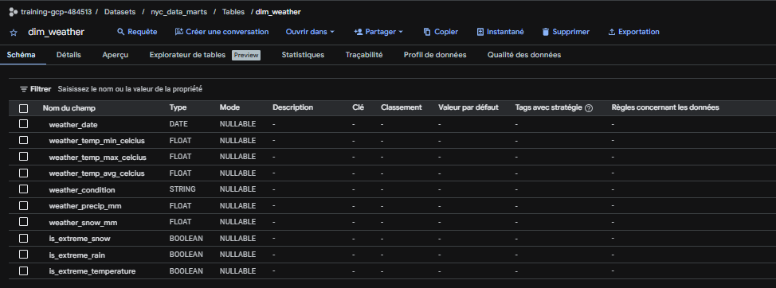

Caracteristiques :
- Une ligne par jour
- Colonnes : weather_date, temp_min/max/avg (Celsius), weather_condition, precip_mm, snow_mm
- Flags extremes : is_extreme_snow (>10mm), is_extreme_rain (>50mm), is_extreme_temperature (>35C ou <-10C)
- Conditions : Clear, Light Rain, Moderate Rain, Heavy Rain, Light Snow, Heavy Snow

---

### Tables de faits

**fact_taxi_trips** - Table de faits principale (INCREMENTAL)

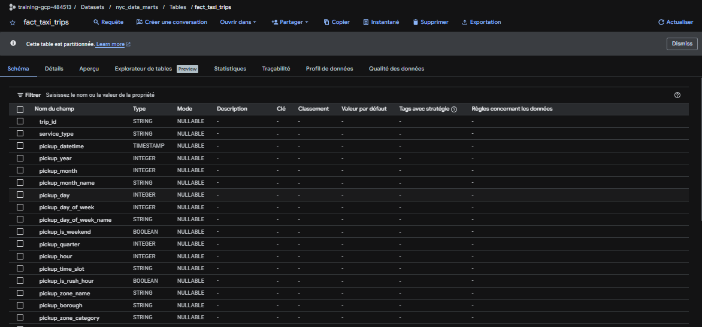

Caracteristiques techniques :
- **Materialisation** : Incremental (seuls les nouveaux enregistrements sont traites)
- **Cle unique** : trip_id (hash MD5)
- **Partitionnement** : Par pickup_datetime (DAY)
- **Clustering** : Par service_type, pickup_borough, is_stuck_in_traffic

Metriques incluses :
- Dimensions temporelles : year, month, day, day_of_week, hour, time_slot, is_rush_hour
- Dimensions geographiques : pickup/dropoff zones et boroughs
- Contexte meteorologique : weather_condition, temperature, flags extremes
- Metriques de course : duration_minutes, distance_miles, category, speed, traffic status
- Indicateur cle : `is_stuck_in_traffic` (duree reelle > 150% duree estimee)

---

**fact_311_complaints_daily** - Plaintes 311 agregees quotidiennement

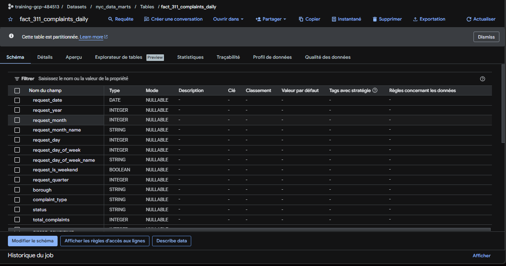

Metriques incluses :
- Agregation par : request_date, borough, complaint_type, status
- KPIs : total_complaints, closed_complaints, open_complaints, pct_closed, avg_resolution_days
- SLA tracking : is_resolved_within_24h, is_resolved_within_week, is_slow_resolution
- Correlation meteo : weather_condition, temperature, precipitations, neige

---

**fact_311_performance_monthly** - Performance agences 311

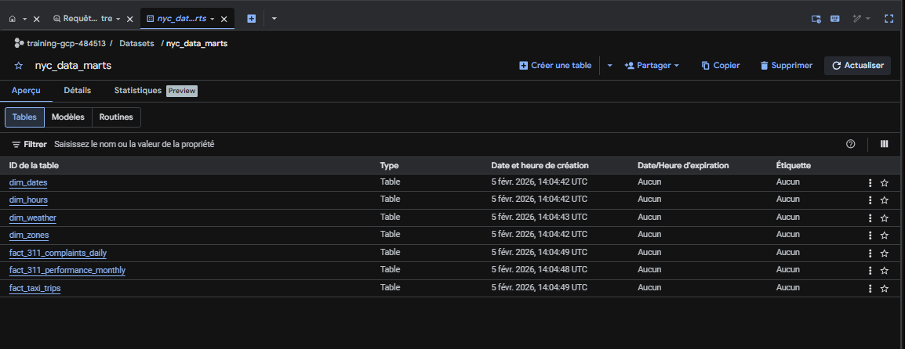

Metriques incluses :
- Agregation par : month, agency, complaint_type
- Volume : total_complaints, closed, open, pending, in_progress
- Performance : avg_resolution_days, median_resolution_days, pct_closed
- Rankings : speed_rank_by_complaint_type, volume_rank_by_agency
- Score composite : performance_score (0-100), performance_category (Excellent/Bon/Moyen/A ameliorer)
- Indicateurs : is_fast_agency, is_high_closure_rate

---

## Optimisations BigQuery

### Partitionnement

Le partitionnement permet de reduire drastiquement les couts de scan en limitant les donnees lues :

| Table | Champ de partition | Granularite | Benefice |
|-------|-------------------|-------------|----------|
| `int_trips_enriched` | pickup_datetime | DAY | Requetes temporelles optimisees |
| `fact_taxi_trips` | pickup_datetime | DAY | Scan limite aux jours demandes |

**Exemple d'economie** : Une requete sur 1 jour au lieu de 1 an reduit le scan de 99.7%

### Clustering

Le clustering organise physiquement les donnees pour accelerer les filtres frequents :

| Table | Cles de clustering | Cas d'usage |
|-------|-------------------|-------------|
| `int_trips_enriched` | service_type, pickup_location_id | Analyse par type de service et zone |
| `fact_taxi_trips` | service_type, pickup_borough, is_stuck_in_traffic | Dashboard trafic et performance |

### Chargement incremental

La table `fact_taxi_trips` utilise le chargement incremental dbt :
- Seuls les enregistrements avec `pickup_datetime > MAX(pickup_datetime)` sont traites
- **Reduction des couts estimee** : 5x par execution (de ~$5 a <$1)
- Strategie de merge sur `trip_id` (hash MD5)

### Materialisation conditionnelle

```yaml
# Configuration dbt_project.yml
models:
  staging:
    +materialized: "{{ 'view' if target.name == 'dev' else 'table' }}"
  intermediate:
    +materialized: "{{ 'view' if target.name == 'dev' else 'table' }}"
  marts:
    +materialized: table  # Toujours table pour analytics
```

Cette approche :
- Reduit les couts en dev (vues = pas de stockage)
- Garantit les performances en prod (tables pre-calculees)

---

## Securite et gouvernance GCP

### Principe du moindre privilege

L'acces aux ressources GCP est strictement controle via IAM avec des permissions minimales :

**Service Account dedie** : `airflow-sa@training-gcp-484513.iam.gserviceaccount.com`

**Permissions BigQuery (granulaires)** :
```
bigquery.datasets.get
bigquery.datasets.update
bigquery.tables.create
bigquery.tables.get
bigquery.tables.update
bigquery.tables.delete
bigquery.jobs.create
```

**Permissions Cloud Storage (granulaires)** :
```
storage.buckets.get
storage.objects.create
storage.objects.get
storage.objects.delete
```


### Configuration

```yaml
# profiles.yml (dbt)
targets:
  prod:
    type: bigquery
    method: service-account
    project: training-gcp-484513
    dataset: nyc_data
    keyfile: /opt/airflow/config/gcp/airflow-gcp-key.json
    location: EU
```

---

## Conteneurisation avec Docker

### Architecture multi-services

Le pipeline utilise Docker Compose pour orchestrer une stack distribuee complete :

```yaml
services:
  postgres:16         # Base de metadonnees Airflow
  redis:7.2-bookworm  # Broker Celery pour taches distribuees
  airflow-apiserver   # API REST et interface web (port 8080)
  airflow-scheduler   # Ordonnancement des DAGs
  airflow-dag-processor  # Parsing des fichiers DAG
  airflow-worker      # Execution des taches (CeleryExecutor)
  airflow-triggerer   # Execution des triggers asynchrones
  flower (optionnel)  # Monitoring Celery (port 5555)
```

### Dockerfile personnalise

```dockerfile
FROM apache/airflow:3.0.1

# Installation des providers et dependances
RUN pip install \
    google-cloud-storage==2.14.0 \
    google-cloud-bigquery==3.14.1 \
    apache-airflow-providers-google==10.22.0 \
    dbt-core==1.7.4 \
    dbt-bigquery==1.7.4
```

### Volumes montes

```yaml
volumes:
  - ./dags:/opt/airflow/dags                      # Fichiers DAG
  - ./nyc_transformation_dbt:/opt/airflow/dbt     # Projet dbt
  - ./logs:/opt/airflow/logs                      # Logs Airflow
  - ./config:/opt/airflow/config                  # Credentials GCP
  - ./plugins:/opt/airflow/plugins                # Plugins custom
```

---

## Qualite des donnees

### Tests dbt implementes

Plus de 80 tests de qualite des donnees sont executes quotidiennement :

**Types de tests utilises :**

| Type | Macro dbt | Exemple d'utilisation |
|------|-----------|----------------------|
| Unicite | `unique` | Verification des cles primaires |
| Non-nullite | `not_null` | Champs obligatoires |
| Plages acceptees | `dbt_utils.accepted_range` | speed 0-100, hour 0-23 |
| Valeurs acceptees | `accepted_values` | borough in ('Manhattan', 'Brooklyn', ...) |
| Expressions custom | `dbt_utils.expression_is_true` | dropoff_datetime >= pickup_datetime |

**Exemples de tests critiques :**

```yaml
# Validation des timestamps HVFHV
- dbt_utils.expression_is_true:
    name: hvfhv_chronological_timestamps
    expression: |
      (request_datetime IS NULL OR on_scene_datetime >= request_datetime)
      AND (on_scene_datetime IS NULL OR pickup_datetime >= on_scene_datetime)
      AND dropoff_datetime >= pickup_datetime
    config:
      severity: error

# Validation des plages de vitesse
- dbt_utils.accepted_range:
    min_value: 0
    max_value: 100
    where: "traffic_avg_speed_mph IS NOT NULL"
```

### Couverture des tests par couche

| Couche | Nombre de tests | Types principaux |
|--------|-----------------|------------------|
| Staging | 30+ | not_null, accepted_range, chronological |
| Intermediate | 25+ | not_null, accepted_range, accepted_values |
| Marts | 35+ | unique, relationships, business rules |

---

## Perspectives et evolutions

- **Visualisation Power BI** : Connexion native BigQuery vers Power BI pour dashboards interactifs
  - Dashboard Vue d'ensemble : KPIs transport temps reel
  - Dashboard Meteo et Mobilite : Correlations visuelles
  - Dashboard 311 : Heatmap plaintes par zone
  - Dashboard Taxi Analytics : Patterns temporels et geographiques

- **Monitoring avance** :
  - Alertes sur echecs de DAG via Slack/Email
  - Metriques de latence des pipelines
  - Tableaux de bord operationnels

- **Machine Learning** :
  - Prediction de la demande taxi par zone et heure
  - Detection d'anomalies sur les patterns de trafic
  - Classification automatique des plaintes 311

- **CI/CD** :
  - GitHub Actions pour tests dbt automatiques
  - Deploiement automatise des DAGs

---

## Installation et configuration

### Prerequis

```bash
# Logiciels requis
- Python 3.9+
- Docker et Docker Compose
- gcloud CLI (installe et configure)
- git

# Comptes necessaires
- Compte GCP avec facturation active
- Projet GCP avec APIs activees (BigQuery, Cloud Storage)
```

### Installation

```bash
# 1. Cloner le repository
git clone https://github.com/Ahmadou0306/NYC_Transportation_Data_Pipeline.git
cd NYC_Transportation_Data_Pipeline

# 2. Configurer les credentials GCP
# Placer le fichier service account dans config/gcp/airflow-gcp-key.json

# 3. Configurer les variables d'environnement
cp .env.exemple .env
# Editer .env avec vos valeurs :
# - GCP_PROJECT_ID
# - GCS_BUCKET_NAME
# - GOOGLE_APPLICATION_CREDENTIALS

# 4. Demarrer la stack Airflow
docker-compose up -d

# 5. Acceder a l'interface Airflow
# http://localhost:8080
# Login : airflow / airflow

# 6. Activer les DAGs depuis l'interface

# 7. Executer les transformations dbt manuellement (optionnel)
docker exec -it airflow-worker bash
cd /opt/airflow/dbt
dbt run --target prod
dbt test --target prod
```

### Structure du projet

```
NYC_Transportation_Data_Pipeline/
|
+-- dags/                           # DAGs Airflow
|   +-- config/
|   |   +-- api_config.py           # Configuration centralisee des APIs
|   +-- horaires/                   # DAGs horaires
|   +-- journalier/                 # DAGs quotidiens
|   +-- mensuels/                   # DAGs mensuels
|   +-- utils/
|       +-- utilitaire.py           # Fonctions utilitaires partagees
|
+-- nyc_transformation_dbt/         # Projet dbt
|   +-- models/
|   |   +-- staging/                # Modeles de nettoyage
|   |   +-- intermediate/           # Modeles de logique metier
|   |   +-- marts/
|   |       +-- business/           # Tables analytiques
|   +-- seeds/                      # Donnees de reference (zones)
|   +-- dbt_project.yml
|   +-- profiles.yml
|   +-- packages.yml
|
+-- config/
|   +-- gcp/
|       +-- airflow-gcp-key.json    # Credentials GCP (gitignore)
|
+-- images/                         # Captures d'ecran documentation
+-- docker-compose.yaml             # Stack Airflow
+-- dockerfile                      # Image custom Airflow
+-- .env.exemple                    # Template variables d'environnement
+-- README.md
```

---

## Documentation et references

### Documentation officielle

- [Apache Airflow Documentation](https://airflow.apache.org/docs/)
- [dbt Documentation](https://docs.getdbt.com/)
- [BigQuery Documentation](https://cloud.google.com/bigquery/docs)
- [NYC Open Data](https://opendata.cityofnewyork.us/)
- [NOAA Climate Data Online](https://www.ncei.noaa.gov/cdo-web/)

### Ressources du projet

- [TLC Trip Record Data](https://www.nyc.gov/site/tlc/about/tlc-trip-record-data.page)
- [NYC 311 Service Requests](https://data.cityofnewyork.us/Social-Services/311-Service-Requests-from-2010-to-Present/erm2-nwe9)
- [NYC Traffic Speed](https://data.cityofnewyork.us/Transportation/DOT-Traffic-Speeds-NBE/i4gi-tjb9)

---

## Auteur

**Ahmadou NDIAYE**

- GitHub : [@Ahmadou0306](https://github.com/Ahmadou0306)
- LinkedIn : [Ahmadou Ndiaye](https://www.linkedin.com/in/ahmadou-ndiaye-792a09205/)
- Email : ahmadou.ndiaye.pro@gmail.com

---